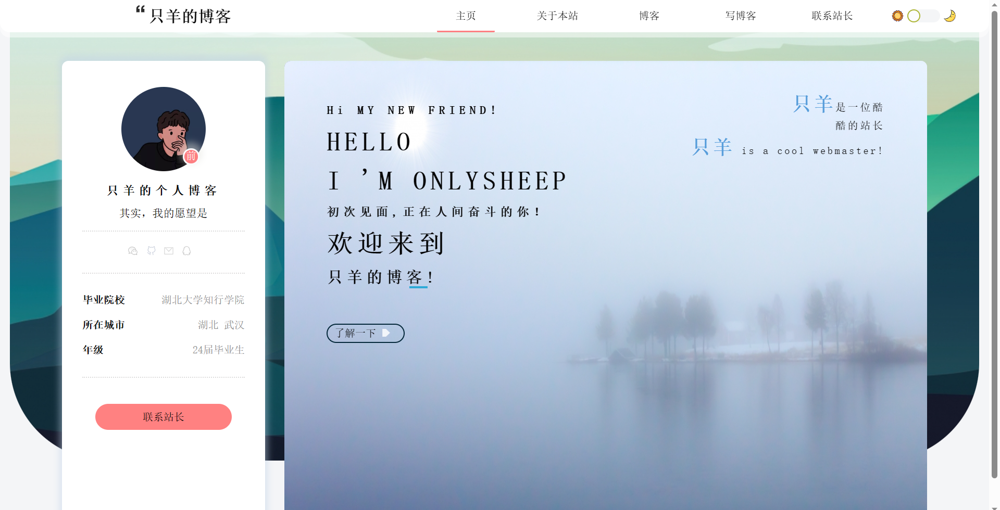
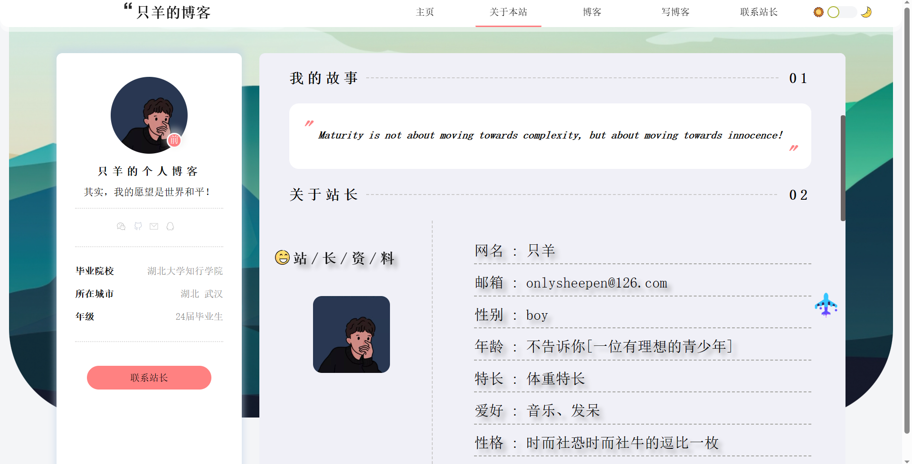
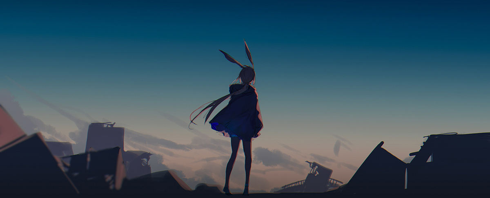
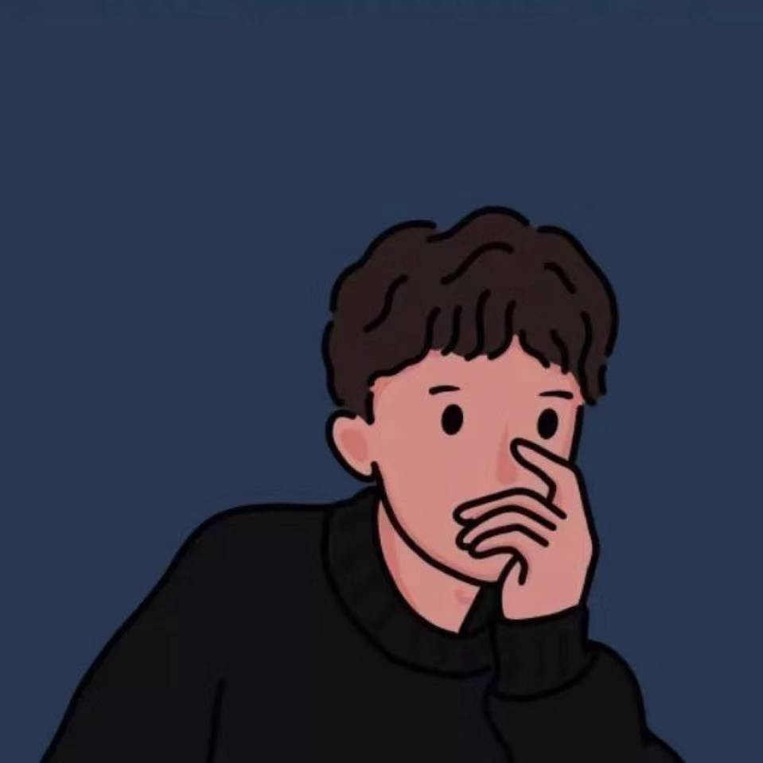
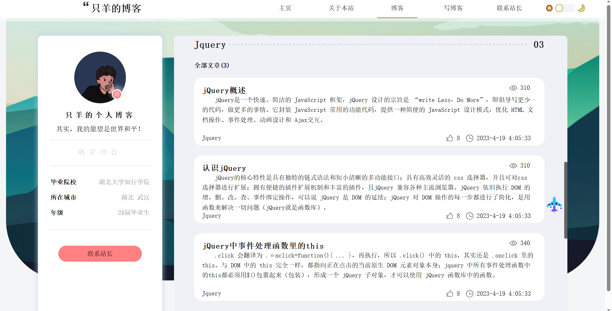
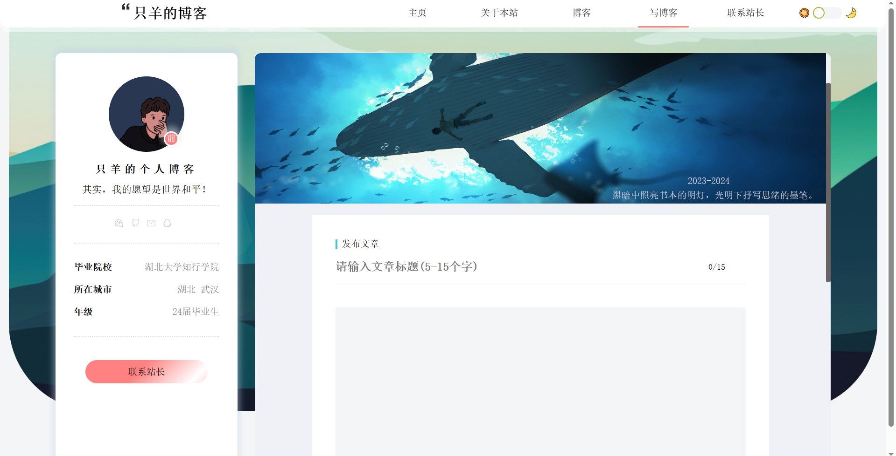
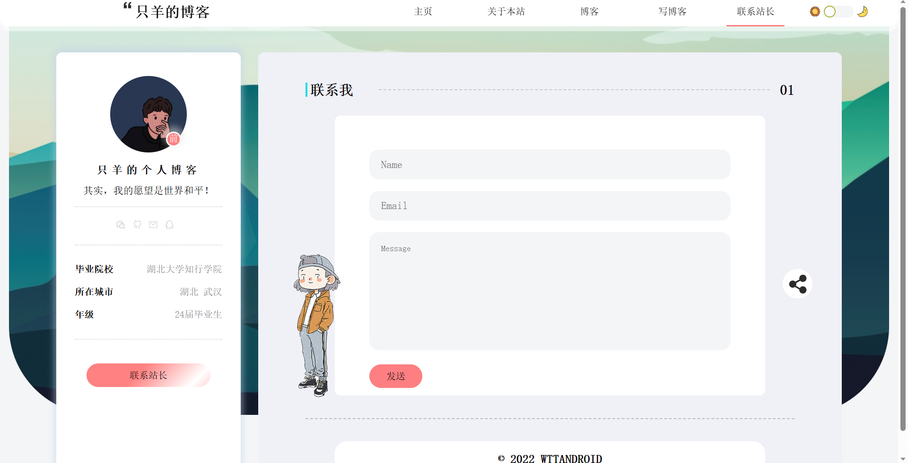
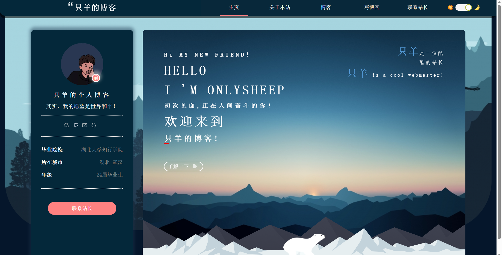

# 个人博客前端静态页面

## 1、项目目录

```text
|—————— images
|—————— js
|—————— upload
|—————— index.css
|—————— index.html
|—————— README.md
```

## 2、项目工具

<kbd>WebStorm 2022.1</kbd>+<kbd>Visual Studio Code</kbd>+<kbd>Microsoft Edge</kbd>+<kbd>Gitee</kbd>

## 3、在线访问网址

<kbd>我的博客 :</kbd>  **http://blog.onlysheeps.com**

## 4、项目意义

### 4.1、<kbd>个人博客</kbd>

> >```java
> >	通常所说的个人博客分为两种：一种是使用他人网站的博客服务所搭建的博客，常见的平台如CSDN、网易新浪博客等，另一种为独立博客，是指在域名、空间及内容上都独立自主的博客，两者各有优劣。
> >    从含义上很容易看出，独立博客在投入使用之前就需要投入一定的建设成本，包括时间与金钱的成本，本文不详细讨论独立博客搭建的技术教程，而使用免费博客平台则省去了大量的前期投入工作，可以留出更多的精力去经营自己博客的内容。同时，使用免费博客平台，更容易获得最初的博客流量，可以肯定的说，只要自己的博客质量有保证，就一定能带来可观的流量。而独立博客在不投入一定的技术与推广的情况下，很难得到访问量。
> >    当然独立博客的优势也非常明显，独立博客的展示程度与效果本身便是个人能力的直接体现，至少体现了自己的审美能力。同时由于独立博客的独立性，可以作出非常个性化的博客与内容，这是免费博客平台无法比拟的。而且随着开源项目越来越多，各种第三方服务的完善，个人搭建独立博客的成本和难度大大降低，即使新手也能搭建出非常美观个性化的个人独立博客。所以近几年来，独立博客的数量越来越多。
> >```

### 4.2、<kbd>价值与意义</kbd>

> >```java
> >	个人博客与QQ空间、朋友圈和微博之流的本质区别，前者服务自己，后者娱乐他人。同时，个人博客拥有专业的编辑能力，诸如代码块、引用、贴图等等功能，都是传统社交工具所不具备的。
> >    积累技术、学习成长、社交展示。独立博客的搭建本身就是一项非常实用的技术，在独立博客的搭建、维护、推广的过程中，任何一名技术人员都能够学习到日常生活工作中遇不到的技术。如果有良好的记录博客的习惯，也是对自身技术的积累过程，同时分享给同圈子的朋友达到社交的目的。
> >    自从2016年以来，互联网行业的竞争愈发激烈，一个优秀的个人博客更能无形中提升自己在同行中的竞争力，一个优秀的个人博客的影响力丝毫不亚于一个优秀的个人开源项目。所以，作为一个经常浏览他人博客的程序员，对于偶遇优秀独立博客总是让人感到非常惊喜。
> >    回归到内容付费的话题，一个流量可观的个人博客，自然而然就具有了流量变现的能力。知识就是金钱，过去这句话是真理，现在和将来也一直都是。优秀的个人博客可以通过网友打赏、社群付费、问答服务、软文广告、电商引流等等许多方式得到一定的收入。既能成全自己又能服务他人，何乐而不为？
> >```

### 4.3、<kbd>总结</kbd>

> >```java
> >个人(技术)博客是兴趣，是坚持，是积累，是开源分享精神，是2017年以后互联网内容大军中的一股清流。建立一个属于自己的个人博客，从今天开始，从来不晚。
> >```

## 5、项目内容

### 5.1、<kbd>主页</kbd>



> 介绍部分站长信息，以及主页画面。
>
> >* 主要代码
> >
> >```html
> ><!-- 主页 -->
> ><div class="con-index">
> >    <!-- hi,myfriend -->
> >    <div id="newfriend">
> >        <div class="new-friend">
> >            <h3>Hi MY NEW FRIEND!</h3>
> ><p>HELLO</p>
> ><p>I 'M ONLYSHEEP</p>
> ><h3>初次见面,正在人间奋斗的你！</h3>
> ><p>欢迎来到</p>
> ><H2>只羊的博客!</H2>
> ><span class="sliding-bar"></span>
> ><div class="new-friend-btn"><a href="#">了解一下</a><span></span></div>
> ></div>
> ><div class="site-introduce">
> >    <div><span>只羊</span>是一位酷</div>
> >        <div>酷的站长</div>
> ><div> <span>只羊</span> is a cool webmaster!</div>
> >    </div>
> ></div>
> >
> ><div class="bearrun">
> >    <div class="mountainblack"></div>
> ><div class="mountainwrite"></div>
> ><div class="bear"></div>
> ></div>
> ><div class="filings">
> >    <div>版权所有只羊工作室&nbsp;<span>|</span> &nbsp;</div>
> >        <div>备案:未备案&nbsp;<span>|</span>&nbsp;</div>
> >            <div>© 2022-2023 All Copyright Reserved</div>
> ></div>
> ></div>
> >```

### 5.2 、<kbd>关于本站</kbd>



> 介绍站长详细信息
>
> > * 主要代码
> >
> > ```html
> > <!-- 关于本站     -->
> > <div class="about-site">
> >     
> >     <button>关于本站</button>
> >     <!-- 我的故事 --> 
> >     <div class="my-story">
> >         <h2>
> >             <span>我的故事</span>
> >             <div> </div>
> >             <span>01</span>
> >         </h2>
> >         <div class="story">
> >             <span>Maturity is not about moving towards complexity, but about moving towards innocence!</span> 
> >         </div>
> >     </div>
> >     <div class="goTop"></div>
> >     <!-- 关于站长 -->
> >     <div class="about-stationmaster">
> >         <div class="stationmaster-title">
> >             <h2>
> >                 <span>关于站长</span>
> >                 <div></div>
> >                 <span>02</span>
> >             </h2>
> >         </div>
> >         <div>
> >             <!-- 站长资料 -->
> >             <div class="stationmaster-data">
> >                 <div>
> >                     <h2>站/长/资/料</h2>
> >                     <div></div>
> >                 </div>
> >                 <div>
> >                     <p>网名 : 只羊</p>
> >                     <p>邮箱 : onlysheepen@126.com</p>
> >                     <p>性别 : boy</p>
> >                     <p>年龄 : 不告诉你[一位有理想的青少年]</p>
> >                     <p>特长 : 体重特长</p>
> >                     <p>爱好 : 音乐、发呆</p>
> >                     <p>性格 : 时而社恐时而社牛的逗比一枚</p>
> >                     <p>梦想 : 有朝一日实现财富自由</p>
> >                     <p>语录 : 成熟不是走向复杂,而是奔赴天真！</p>
> >                 </div>
> >             </div>
> >     </div>
> > </div>
> > ```

### 5.3、<kbd>博客内容</kbd>



> 展示个人发表的博客文章和技术新闻
>
> >* 主要代码
> >
> >```html
> ><div class="blog-jQuery-1 blog-curent blog-article ">
> >    <a href="#">
> >        <h2>jQuery概述</h2> <span class="watch-count"> 310</span>
> >        <p>jQuery是一个快速、简洁的 JavaScript 框架，jQuery 设计的宗旨是 “write Less，Do
> >            More”，即倡导写更少的代码，做更多的事情。它封装
> >            JavaScript 常用的功能代码，提供一种简便的 JavaScript 设计模式，优化 HTML 文档操作、事件处理、动画设计和 Ajax交互。</p>
> >        <div class="bottom-module"><span class="column">Jquery</span>
> >            <i class="give-time"><span class="give-thumbs-up"> 8</span><span
> >                                                                                                                            class="release-time"> 2023-4-19
> >                4:05:33</span></i>
> >        </div>
> >    </a>
> ></div>
> >```

### 5.4、<kbd>写博客</kbd>



> form表单提交文章信息（注：因为静态页面未和后端进行交互不可使用）
>
> > * 主要代码
> >
> > ```html
> > <form action="#" method="post">
> >     <div class="fabu">
> >         <div class="fabu-title"><span></span> 发布文章</div>
> >         <div class="fabu-input">
> >             <input id="fabu-input" type="text" placeholder="请输入文章标题(5-15个字)">
> >             <div>0/15</div>
> >         </div>
> >         <div class="textarea">
> >             <textarea>
> >             </textarea>
> >             <span>共 0 字</span>
> >             <span>保存于 2023/4/19 21:09:33</span>
> >             <a href="#"></a>
> >         </div>
> >     </div>
> >     <div class="fabu-details">
> >         <div>
> >             <span>文章标签</span>
> >             <input type="radio" name="lable" id="" value="h5"> h5
> >             <input type="radio" name="lable" id="" value="javascript"> javascript
> >             <input type="radio" name="lable" id="" value="jQuery"> jQuery
> >             <input type="radio" name="lable" id="" value="vue"> vue
> >             <input type="radio" name="lable" id="" value="nodejs"> nodejs
> >             <input type="radio" name="lable" id="" value="其他" checked> 其他
> >         </div>
> >         <div id="zhanyao-text">
> >             <span>文章摘要</span>
> >             <textarea name="zhanyao" id="" rows="2"></textarea>
> >         </div>
> >         <div class="Classification-column">
> >             <span>分类专栏</span> <span> + 新建分类专栏</span>
> >         </div>
> >         <div id="fabu-blog">
> >             <span>文章类型</span>
> >             <input type="radio" name="class" id="" value="original" checked> 原创
> >             <input type="radio" name="class" id="" value="transport"> 转载
> > 
> >         </div>
> >         <input type="submit" value="发布文章">
> >     </div>
> > </form>
> > ```

### 5.5、<kbd>联系站长</kbd>



> 通过邮件方式联系站长（注：因为静态页面未和后端进行交互不可使用）
>
> > * 主要代码
> >
> > ```html
> > <!-- 联系站长 -->
> > <div class="contact-Author">
> >     <h2>
> >         <span> <span class="vertical-bar"></span> 联系我</span>
> >         <div> </div>
> >         <span>01</span>
> >     </h2>
> >     <div id="contact">
> >         <div class="you-name"><input type="text" placeholder="Name"></div>
> >         <div class="you-email"><input type="text" placeholder="Email"></div>
> >         <div class="message">
> >             <textarea name="message" placeholder="Message"></textarea>
> >         </div>
> >         <div id="sumbit"><a href="#">发送</a></div>
> >         <div class="contact-way">
> > 
> >             <ul>
> >                 <li><a href="#"></a></li>
> >                 <li><a href="https://gitee.com/only-sheep" target="_blank"></a>
> >                 </li>
> >                 <li><a href="https://github.com/OnlySheep" target="_blank"></a></li>
> >                 <li><a href="tencent://AddContact/?fromId=45&fromSubId=1&subcmd=all&uin=2932944854&website=www.oicqzone.com
> >                     "></a></li>
> > 
> >             </ul>
> >         </div>
> >     </div>
> >     <div id="line"></div>
> >     <div class="wttandroid">
> >         © 2022 WTTANDROID
> >     </div>
> > 
> > </div>
> > ```

## 6、项目特色

### 6.1、<kbd>黑夜模式切换</kbd>



>* 使用jQuery的class或者id选择document对象的技术改变class的值以获取不同的样式
>
>>写一套黑夜模式的CSS样式，使用jQuery对class元素进行选择，设置一个全局变量为当前的模式状态，默认为白天，当用户点击切换的时候，选择每一个预留好的钩子class选择器或者id选择器，改变class值以获取不同的CSS属性。
>
>主要代码
>
>>```javascript
>>//切换
>>var status_btn = 0; //白 0 黑 1 
>>$(".switch-btn").click(function () {
>>    $("body").toggleClass("background");
>>    $(".backdrop").toggleClass("backdrop-switch");
>>    $("header").toggleClass("head-change");
>>    $(".left-box").toggleClass("change");
>>    $(".new-friend-btn").toggleClass("new-friend-btn-switch");
>>    if (status_btn === 0) {
>>        $(".circle").css({
>>            "transform": "translateX(30px)"
>>        });
>>        $(".con-index").addClass("con-index-ground change");
>>        $(".bearrun").css({
>>            "display": "block"
>>        });
>>        $("header .head-nav ul").css({"color":"#fff","background-color":"#08283a"})
>>        status_btn = 1
>>    } else if (status_btn === 1) {
>>        $(".circle").css({
>>            "transform": "translateX(0px)"
>>        });
>>        $(".con-index").removeClass("con-index-ground change");
>>        $(".bearrun").css({
>>            "display": "none"
>>        });
>>        $("header .head-nav ul").css({"color":"black","background-color":"#fff"})
>>        status_btn = 0;
>>    }
>>})
>>```

### 6.2<kbd>css动画效果</kbd>


> 这个我也不会


## 7、项目参考

| 参考内容 |  网址  |
| :------- | :----: |
|          | 单元格 |
| 单元格   | 单元格 |
